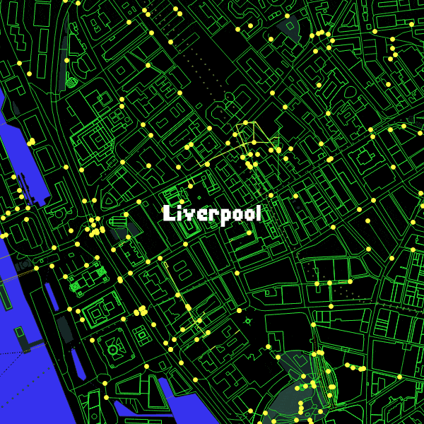

# 👋 Hi, I'm Yuta Sato

---

## 🎓 About Me

PhD Candidate at the [**Geographic Data Science Lab**](https://www.liverpool.ac.uk/geographic-data-science/), University of Liverpool, specializing in **Graph Representation Learning** and **Urban Morphometics** for **Sustainable Urban Developments**. My research bridges advanced machine learning with spacial data science to solve complex urban challenges.

  

## 🚀 Featured Projects

### 🌆 [city2graph](https://github.com/c2g-dev/city2graph) - GeoAI with Graph Neural Networks

A Python library for converting geospatial datasets into graph representations with seamless integration of GeoPandas, NetworkX, and PyTorch Geometric.

